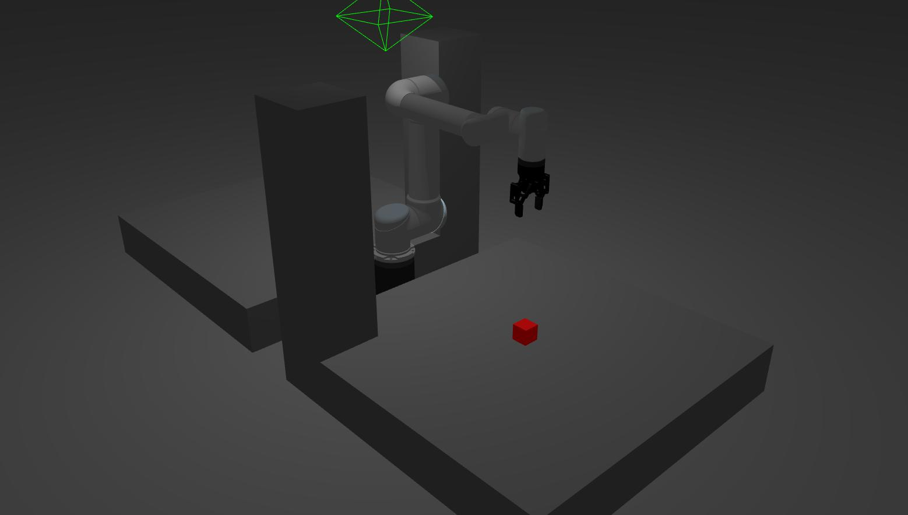

# UR5 Control with Gripper (_Pick-and-Place with Octomap_)


## Prerequisite

- Ubuntu 20.04
- ROS Noetic Ninjemys
- MoveIt! Motion Planning Framework
- Gazebo 11

## Installation

Install prerequisite packages

```bash
sudo apt install ros-noetic-ros-numpy ros-noetic-ros-controllers ros-noetic-ros-control ros-noetic-cv-bridge ros-noetic-image-proc ros-noetic-image-pipeline
```

Initialise the catkin workspace:

```bash
mkdir -p ~/catkin_ws/src
cd ~/catkin_ws/src
```

Clone prerequisite repositories:

```bash
# Clone this repository
git clone https://github.com/juniorsundar/ur5_gripper_control.git
# Cloning robot and gripper description files
git clone -b melodic-devel https://github.com/ros-industrial/universal_robot.git
git clone https://github.com/filesmuggler/robotiq.git
# Cloning Realsense Gazebo Plugin
git clone https://github.com/issaiass/realsense_gazebo_plugin.git
```

Build catkin workspace:

```bash
cd ~/catkin_ws
catkin_make
source devel/setup.bash
```


## Run Simulation and Task

To launch the robot and environment, and run the pick-and-place operation:

```bash
roslaunch ur5_gripper_control simulation.launch
```

The nuances of how this works are explained below.

## Robot and Workspace



### Robot _(internal model)_

- UR5
- Robotiq 85 Gripper
- Raised Pedestal (20cm) as Base

refer to: [```urdf/ur5_robotiq85_gripper.urdf.xacro```](./urdf/ur5_robotiq85_gripper.urdf.xacro)

### Workspace _(environment)_

- Start and End Platform (1m x 1m x 20cm)
- Pillars at Corner of Platforms (20cm x 20cm x 75cm)
- Red Cube (5cm x 5cm x 5cm) (target of pick-and-place operation)

refer to: [```worlds/world.world```](./worlds/world.world)

## Perception and Octomap

Since planning is being managed by the MoveIt! Motion Planning Framework, we can rely on the Octomap plugin integrated into it. The benefit of this method is that it automatically removes the robot model from the octomap.

To facilitate the octomap generation, we need a pointcloud. On that note, due to the spread-out nature of the workspace, two perception sources are required - one facing each of the platforms.

### Stereo vs. Infrared

This repository comes with both [stereo cameras](./urdf/stereo_camera.urdf.xacro) and [infrared depth cameras](./urdf/_d435.urdf.xacro). The left and right camera feeds from the stereo cameras are processed through the [image_proc](https://github.com/ros-perception/image_pipeline) ROS package and outputs PointCloud2 depth data.

> You can access the depth pointclouds calculated from stereo cameras by accessing:
> - ```/camera_1_stereo/points2``` - sensor_msgs/PointCloud2
> - ```/camera_2_stereo/points2``` - sensor_msgs/PointCloud2
>
> when running the simulation.

However, it was found to be insufficiently accurate. An alternative is to use an infrared depth sensor that publishes a PointCloud2 directly.

> You can access the depth pointclouds from infrared depth cameras by accessing:
> - ```/camera_1_depth/depth/color/points``` - sensor_msgs/PointCloud2
> - ```/camera_1_depth/depth/color/points``` - sensor_msgs/PointCloud2
>
> when running the simulation.

### MoveIt! Octomap Plugin

For this simulation, we are relying on the infrared depth cameras for their pointclouds. MoveIt! offers pointcloud compatibility using the ```occupancy_map_monitor/PointCloudOctomapUpdater``` sensor plugin (refer to [```config/sensors_3d.yaml```](./config/sensors_3d.yaml)). This plugin takes in PointCloud2 and updates the octree.

### Filtering Workspace PointCloud2

Since the octomap covers everything in the environment, it also includes the block. We don't want this because then the anticipated collision will not allow for the motion plan to succeed. This can be addressed by filtering out the red coloured points from the PointCloud2. This is programmed as a ```rosservice``` that publishes the filtered PointCloud2 directly to the octomap.

refer to: [```scripts/publish_octomap_cloud.py```](./scripts/publish_octomap_cloud.py)

## Motion Planning and Pick-and-Place

Motion planning is performed through MoveIt! as explained before. Refer to: [```scripts/pick_place.py```](./scripts/pick_place.py).

The general methodology for planning and execution is:

1. Clear octomap to empty previously recognised planning scene.
2. Update octomap with filtered PointCloud2s from cameras.
3. Plan using ```MoveGroupCommander```.
4. Execute plan (fallback to verify if plan was successful).

## Acknowledgement

This repository depends on:

- [Universal Robots Description](https://github.com/ros-industrial/universal_robot) from [ROS-Industrial](https://github.com/ros-industrial),
- The forked [Robotiq Gripper Description](https://github.com/filesmuggler/robotiq) by [Krzysztof Stężała](https://github.com/filesmuggler),
- [Realsense Gazebo Plugin](https://github.com/issaiass/realsense_gazebo_plugin) by [Rangel Isaías Alvarado Walles](https://github.com/issaiass)